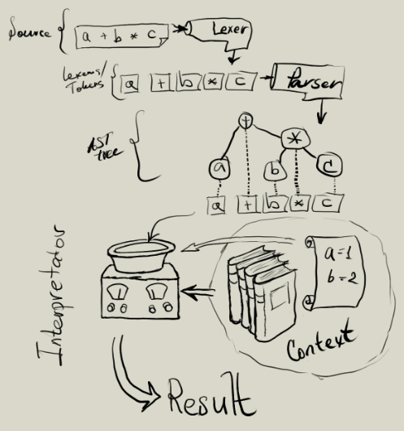

Парсер + интерпретатор js выражений
===================================

Данный проект позволяет интерпретировать 
части конструкций java script.

**Отличительные черты**

* Интерпретация унарных, бинарных и других выражений на языке javascript
* Возможность работать с объектами java
    * Получать доступ к методам/свойствами объектов
    * Расширять объекты java путем добавления виртуалных свойств    
* Контролировать доступ к методам/свойствам объектов java

Использование
-------------

### maven

Добавьте зависимость в pom.xml

    <dependecy>
        <groupId>xyz.cofe</groupId>
        <artifactId>cxel</artifactId>
        <version>1.0-SNAPSHOT</version>
    </dependecy>

### Синтаксис языка

Синтаксис языка описывается [в документе Синтаксис](doc/js-syntax.md)

### Пример

```java
package xyz.cofe.cxel.js.demo;

import xyz.cofe.cxel.js.*;

/** Демонстрация */
public class Demo1 {
    /** Данный класс будет передав в js */
    public static class Interop1 {
        /** Добавляем свойство str */
        private String str;
        public String getStr(){ return str; }
        public void setStr( String value ){
            this.str = value;
        }
    
        /** Вывод текста в терминал
        @param str отображаемый текст
        */
        public void print( String str ){
            System.out.println("call print: "+str);
        }
    
        /** Повтор текста
        @param str текст
        @param count сколько раз надо повторить
        @return текст повторенный count раз
        */
        public String repeat( String str, int count ){
            if( str==null )return null;
            if( count<=0 )return "";
            if( count==1 )return str;
            if( str.length()==0 )return str;
            StringBuilder sb = new StringBuilder();
            for( int i=0; i<count; i++ ){
                sb.append(str);
            }
            return sb.toString();
        }
    }

    /**
    Входная точка в приложение 
    */
    public static void main(String[] args){
        // Данный объект будет участвовать в js
        Interop1 interop = new Interop1();
    
        // Указываем свойство str
        interop.setStr("xtr");

        // Добавляем интерпретатор
        JsEvaluator evaluator = new JsEvaluator();

        // В контекст исполнения добавляяем три переменных: i, a, b
        evaluator.context()
            .bind("i",interop)
            .bind("a","str")
            .bind("b",10)
            ;

        // Интерпретируем выражение
        Object res = evaluator.eval("i.print( a + b + i.str )");
        System.out.println("result "+res);
        // будет выведено:
        //  call print: str10xtr
        //  result null

        // Можно в более краткой форме
        System.out.println(
            new JsEvaluator().configure(
                ev->ev.context().bind("o",interop)
            ).eval("o.repeat('aB',2)")
        );
        // будет выведено:
        // aBaB
    }
}
```

Описание устройства
--------------------



Библиотека состоит из следующих частей

* Лексический анализатор (`xyz.cofe.cxel.js.JsLexer`) - из исходного текста вычленяет 
  список лексем (`xyz.cofe.cxel.tok.*`) и передает их на вход парсеру.
* Парсер (`xyz.cofe.cxel.js.JsParser`) - из входящего списка лексем строит 
  AST дерево (`xyz.cofe.cxel.ast.*`).
* Интерпретатор (`xyz.cofe.cxel.eval.Eval`) - используя преопределенные 
  функции (`xyz.cofe.cxel.js.op.*`) выполняет программу заданную ast деревом. 
  В своем составе содержет контекст исполнения (`xyz.cofe.cxel.eval.EvalContext`). 
* Предопределенные функции - набор функций для корректной интерпретации AST дерева.

### Лексический анализатор

Лексический анализатор можно переопределить или использовать свой,
его задача передать лексемы (потомки класса `xyz.cofe.text.tparse.CToken`) в парсер.

Лексемма это элементарная единица которая используется парсером для создания 
AST дерева.
 
### Парсер

Парсер, он же синтаксический анализатор строить из списка лексем AST дерево.

### Интерпретатор

Интерпретатор (`xyz.cofe.cxel.eval.Eval`) по дереву AST выполняет код.

Данный интерпретатор позволяет:

* Использовать переменные заданные контекстом исполнения (`xyz.cofe.cxel.eval.EvalContext`).
* Переопределить поведение операторов
* Использовать имплицитное преобразование данных передаваемых 
  из переменных/вычесленных значений в функцию java
* Контролировать вызываемые методы java

Интерпретатор
---------------

### Добавление переменных в конекст исполнения

```java
import xyz.cofe.cxel.js.JsEvaluator;

public class Demo2 {
    public void configureContext(JsEvaluator jsEvaluator){
        EvalContext ctx = jsEvaluator.context();

        // Добавляем ссылку на объект
        ctx.bind("i",interop);

        // Добавляем переменную a
        ctx.bind("a","str");
    
        // Добавляем переменную b
        ctx.bind("b",10);
    
        // Добавляем переменную concat, 
        // которая будет использоваться как функция
        ctx.bindFn( 
            "concat", // имя функции
            String.class, String.class, // типы аргументов 
            String.class, // тип возвращаемого значения
            (a,b)->a+b ); // тело функции
    }
}
```

Переопределение поведения операторов и/или функций
--------------------------------------------------

```java
import xyz.cofe.cxel.js.JsEvaluator;

public class Demo3 {
    public void overrideOperators(JsEvaluator jsEvaluator){
        // В данном классе используется только одна функция repeat()
        // реализацию см выше
        Interop1 interop1 = new Interop1();
        
        // Добавляет реализацию оператора *
        jsEvaluator.context().bindFn("*",
            String.class, Double.class, // входные аргументы
            String.class, // результат
            (str,cnt)->interop1.repeat(str,cnt.intValue())
        );

        // Переопределяем реализацию оператора *
        jsEvaluator.context().bindFn("*",
            Double.class, Double.class, // входные аргументы
            Double.class, // результат
            (a,b)-> a==1.0 && b==1.0 ? 123.0 : a*b
        );
    
        // Выведет 123.0
        System.out.println(
            jsEvaluator.eval( "1 * 1" )
        );
    
        // Выведет strstrstr
        System.out.println(
            jsEvaluator.eval( "'str' * 3" )
        );
    }
}
```